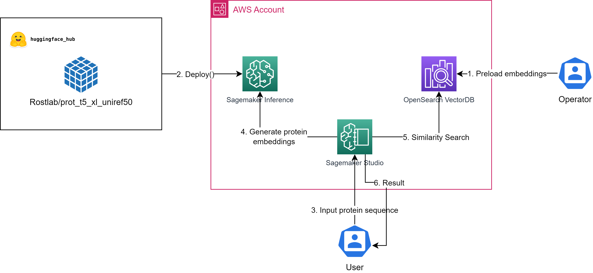

# Protein Similarity Search using ProtT5-XL-UniRef50 and Amazon OpenSearch

This repository contains code and notebooks that detail a protein similarity search solution using the [ProtT5-XL-UniRef50 model](https://huggingface.co/Rostlab/prot_t5_xl_uniref50/tree/main), [Amazon OpenSearch Service](https://aws.amazon.com/opensearch-service/) and [Amazon Sagemaker](https://aws.amazon.com/sagemaker/).

A common workflow within drug discovery is searching for similar proteins, as similar proteins likely have similar properties. Given an initial protein, researchers often look for variations which exhibit stronger binding, better solubility, or reduced toxicity. With this solution, we will propose an architecture based on OpenSearch for similarity search and the open source model [ProtT5-XL-UniRef50](https://huggingface.co/Rostlab/prot_t5_xl_uniref50/tree/main), from which we will use to generate embeddings. Embeddings are vectors which encode properties - similar embeddings have similar properties.

## Solution Overview

 Let’s walk through the solution and all its components:

1. We use [OpenSearch Vector DB capabilities](https://aws.amazon.com/blogs/big-data/amazon-opensearch-services-vector-database-capabilities-explained/) to store a sample of 20k pre-calculated embeddings. These will be used to demonstrate similarity search. OpenSearch has advanced vector DB capabilities supporting multiple popular vector DB algorithms. For an overview of such capabilities refer to [this overview](https://aws.amazon.com/blogs/big-data/amazon-opensearch-services-vector-database-capabilities-explained/).
This repository contains code and notebooks that detail a protein similarity search solution using the [ProtT5-XL-UniRef50m](https://huggingface.co/Rostlab/prot_t5_xl_uniref50) and [Amazon Sagemaker](https://aws.amazon.com/sagemaker/).
2. The ML model used for protein embeddings calculations is the open source [prot_t5_xl_uniref50](https://huggingface.co/Rostlab/prot_t5_xl_uniref50/tree/main), which is hosted on [Huggingface Hub](https://huggingface.co/Rostlab/prot_t5_xl_uniref50/tree/mainc). We leverage the [Sagemaker Huggingface Inference Toolkit](https://github.com/aws/sagemaker-huggingface-inference-toolkit) to quickly customise and deploy the model on Sagemaker.
3. The model is deployed; the solution is ready to calculate embeddings on any input protein sequence and perform similarity search against the protein embeddings we have preloaded on OpenSearch.
4. We use a Sagemaker Studio Notebook to show how to deploy the model on Sagemaker and then use an endpoint to extract protein features in the form of embeddings.
5. After we have generated the embeddings in real-time from the Sagemaker Endpoint, we run a query on OpenSearch to determine the 5 most similar proteins currently stored on OpenSearch index.
6. Finally the user can consult the result directly from the Sagemaker Studio Notebook.

## Repository Contents

deploy-and-similarity-search.ipynb: this notebook illustrates the process of deploying the ProtT5-XL-UniRef50 model on Amazon SageMaker, running protein feature extraction using SageMaker endpoints and similarity search with OpenSearch.

opensearch-setup-and-preload.ipynb: this notebook guides users through the creation and setup of OpenSearch Service domain, index creation, and the pre-loading of pre-calculated protein embeddings from UniProt.

Inference.py: this script contains the custom code for loading the ProtT5-XL-UniRef50 model, pre-processing the input and generating predictions.

## Pre-requisites
To utilize the code and resources in this repository, you should have the following pre-requisites:

- An active AWS account with appropriate permissions to create and manage Amazon SageMaker Studio or SageMaker notebook instances.
- The necessary permissions to create and manage an OpenSearch domain within your AWS account.
- The rights to deploy a SageMaker endpoint, which will be used to host the ProtT5-XL-UniRef50 machine learning model for protein embeddings calculations.

## Deploy

### Set up Amazon OpenSearch Service
1. Follow [these instructions](https://docs.aws.amazon.com/opensearch-service/latest/developerguide/gsgcreate-domain.html) to create an Amazon OpenSearch Service domain. Make sure to record the username, password and domain endpoint.
2. Open the deploy-and-similarity-search.ipynb notebook. Follow the instructions in the notebook to create an index and populate it with the pre-calculated protein embeddings.

### Deploy the Machine Learning Model
1. Open the deploy-and-similarity-search.ipynb notebook.
2. Follow the instructions in the first part of the notebook to install necessary libraries, download the model artefacts, create the required folder structure, and deploy the model to Amazon SageMaker.

## Usage
The second part of the deploy-and-similarity-search.ipynb notebook uses a sample protein, [Immunoglobulin Heavy Diversity 2/OR15-2A](https://www.genecards.org/cgi-bin/carddisp.pl?gene=IGHD2OR15-2A), calculate its embeddings and find the 5 most similar proteins between the 20k Homo Sapiens pre-loaded dataset.
The example successfully shows that the proteins returned from OpenSearch all fall under the Immunoglobulins family and are bio-functionally similar.

## Costs and Cleaning Up
This solution creates an OpenSearch domain which is billed according to number and instance type selected during creation time, please refer to the [OpenSearch Service Pricing page](https://aws.amazon.com/opensearch-service/pricing/) for the rate of those. You will also be charged the Sagemaker endpoint created by the deploy-and-similarity-search notebook, which is currently using a ml.g4dn.8xlarge instance type, you can find its pricing [here](https://aws.amazon.com/sagemaker/pricing/). Finally, you are charged for the Sagemaker Studio Notebooks according to the instance type you are using as detailed on the [pricing page](https://aws.amazon.com/sagemaker/pricing/).

To clean up the resources created by this solution please:

* delete  the OpenSearch domain created previously, [here a guide](https://docs.aws.amazon.com/opensearch-service/latest/developerguide/gsgdeleting.html);
* delete  the Sagemaker endpoint, [here a guide](https://docs.aws.amazon.com/sagemaker/latest/dg/realtime-endpoints-delete-resources.html);
* shutdown  the Sagemaker Studio Notebooks you were using, [here a guide](https://docs.aws.amazon.com/sagemaker/latest/dg/notebooks-run-and-manage-shut-down.html).

## Security
See [CONTRIBUTING](CONTRIBUTING.md) for more information.

## License
This library is licensed under the MIT-0 License. See the [LICENSE](LICENSE.txt) file.
